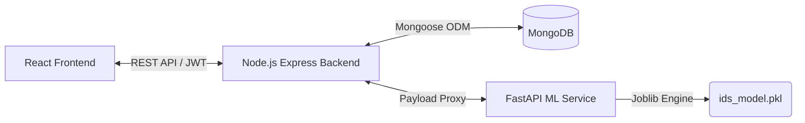

# 🛡️ ML-Powered Intrusion Detection System (IDS)

A secure, three-tier web application designed to classify network traffic and detect potential intrusions using machine learning. Powered by the NSL-KDD dataset framework, the platform offers automated traffic ingestion, granular administrative controls, and real-time security analytics.

---

## 🚀 Key Features

### 🔍 Threat Detection & Ingestion
* **Dual Ingestion Engine:** Seamlessly processes standard network log CSV files or raw Wireshark packet captures (`.pcap`/`.pcapng`).
* **Automated Feature Extraction:** Converted packet captures are translated on-the-fly into model-compatible network connection features.
* **High-Fidelity Classification:** Leverages a Scikit-learn pipeline to identify 41 characteristic features, flagging anomalies like Neptune, Smurf, Satan, Portsweep, and Nmap.

### 🔐 Enterprise Security & Access
* **Two-Factor Authentication:** Robust access control requiring 6-digit email OTP verification (powered by Resend) with a strict 10-minute validity window.
* **Role-Based Access Control (RBAC):** Strictly segregates actions between `Admin`, `Analyst`, and `Viewer` tiers to control execution and scanning privileges.
* **Production Security Guards:** Passwords hardened using `bcrypt` (10 rounds) alongside transient, short-lived JWT authorization payloads.

### 📊 Admin Control & Analytics *(New)*
* **Admin User Management UI:** Comprehensive centralized dashboard for tracking, provisioning, and overriding user roles across the platform.
* **Interactive Threat Charts:** Rich data visualizations mapping out historical incident frequency, vector distributions, and detection confidence margins.
* **Persistent Attack Log:** Deep audit trail backed by MongoDB tracking full attack vectors, chronological timestamps, and confidence percentages.

---

## 📐 System Architecture

The ecosystem relies on a decoupled, three-tier microservices pipeline optimized for processing speed and system isolation:



* **Frontend:** React 19 + Vite styled with minimalist Tailwind CSS surfaces and Framer Motion transitions.
* **Backend:** Node.js Express server acting as the secure gateway, API proxy, and database controller.
* **ML API Microservice:** High-performance Python FastAPI service running Scapy, Pandas, and Scikit-learn.

---

## 📁 Repository Structure

```text
Intrusion-Detection-System/
├── frontend/                 # React 19 SPA (Vite + Tailwind CSS)
├── backend/                  # Node.js Express Gateway & Core Controllers
├── python/                   # FastAPI Service & Feature Extraction Pipeline
├── samples/                  # Pre-compiled CSV & PCAP validation vectors
└── docs/                     # Academic & Architecture Documentation

```

---

## 🚦 Quick Start Guide

### Prerequisites

* Node.js (v18+)
* Python (v3.10+)
* MongoDB Local Instance

### Installation Step-by-Step

#### 1. Setup Database

Ensure your local MongoDB service is actively listening on its standard port:

```bash
mongodb://localhost:27017/Intrusion-Detection

```

#### 2. Initialize FastAPI Engine

```bash
cd python
pip install -r requirements.txt
uvicorn app:app --reload --port 8000

```

#### 3. Initialize Node.js Gateway

Configure your `.env` variables inside `/backend` (JWT secrets, Resend API configurations) before running:

```bash
cd ../backend
npm install
npm start

```

#### 4. Spin Up the User Interface

```bash
cd ../frontend
npm install
npm run dev

```

Open `http://localhost:5173` to explore the dashboard.

---

## 🧪 Evaluation Data

Test data files are included within the `/samples` path to aid validation workflows. Sample profiles span single-row connection captures to highly complex mixed DoS and probing simulation logs.

---

## 🔮 Future Enhancements

While the core classification engine and dashboard architecture are fully operational, the following roadmap outlines planned technical upgrades to transition this system from sandbox analysis to a production-grade enterprise deployment:

### ⚡ Operational Scalability

* **Real-Time Packet Ingestion:** Integrating low-level packet capture interfaces (via socket streaming) to tap live interfaces directly, enabling real-time stream processing instead of relying on batch file uploads.
* **Advanced Extraction Chronology:** Transitioning from static, flow-grouped feature calculations to a rolling, full KDD 2-second time window feature extraction mechanism on continuous PCAP streams.

### 🛠️ Intelligence & Core Lifecycle

* **Automated MLOps Pipeline:** Developing an isolated model retraining loop that takes verified, newly flagged threats from the historical database to continuously adapt and update the underlying pipeline against evolving threat patterns.
* **Extended Attack Coverage:** Expanding model validation beyond legacy NSL-KDD configurations to natively generalize across modern, zero-day exploit patterns and distributed cloud-native vectors.

### 📋 Enterprise Reporting & Tooling

* **Cryptographic PDF Audits:** Implementing an on-the-fly PDF compilation layer to generate cryptographically signed executive summaries and technical threat assessment sheets directly from incident log dashboards.
* **Active Threat Remediation:** Designing webhook mechanisms to integrate with external software-defined firewalls, automatically dropping source IPs flagged with high-confidence attack signatures.

---


```

```
